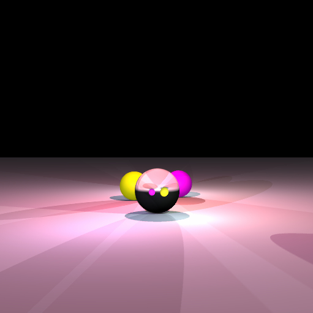

# goTR4CE
A go version of TR4CE

The OpenGL frontend is based on https://github.com/go-gl/examples which states that copyright is a BSD style license found in the LICENSE file, which is nowhere to be found =)

OpenGL (go-gl) is used to create two triangles, and a 2D texture which we can render on/into.

